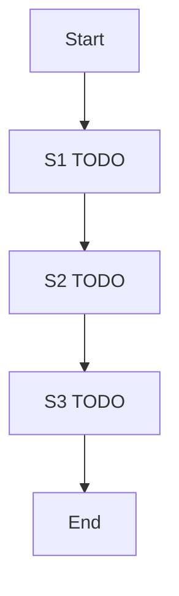

# Workflow map

Grading criterion **#1 Workflow Mapping** (weight x3).

Each step must be labeled as exactly one of: **deterministic**, **LLM judgment**, or **human-in-the-loop**.

## Company / process

- **Company:** TODO — real or fictional; do not invent until the owner chooses.
- **Process:** TODO — the operational workflow to map.
- **Goal of AI in this process:** TODO — what judgment we are automating, and what we refuse to automate.

## Map

Replace the placeholder rows. Keep the table; add rows and a diagram if the process needs them.

| ID | Step | Actor / system | Input | Output | Type | Why this type |
|---|---|---|---|---|---|---|
| S1 | TODO | TODO | TODO | TODO | deterministic / LLM judgment / human-in-the-loop | TODO |
| S2 | TODO | TODO | TODO | TODO | deterministic / LLM judgment / human-in-the-loop | TODO |
| S3 | TODO | TODO | TODO | TODO | deterministic / LLM judgment / human-in-the-loop | TODO |

## FDE judgment notes

- Where AI is **not** applied, and why: TODO
- Escalation / HITL triggers: TODO
- Ambiguous cases that stay with a human: TODO
