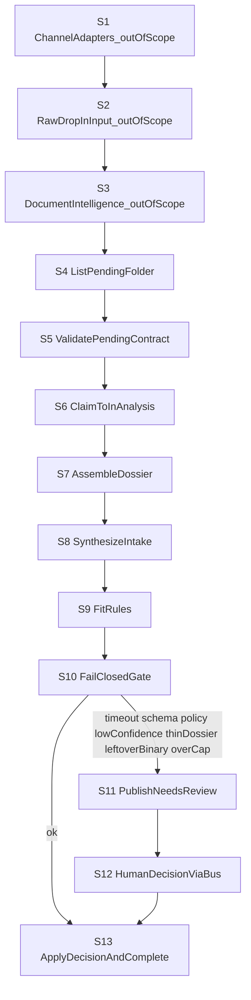

# Workflow map

Grading criterion **#1 Workflow Mapping** (weight x3).

Each step is exactly one of: **deterministic**, **LLM judgment**, or **human-in-the-loop**.

## Company / process

- **Company:** Taller — a software consultancy.
- **Process:** Project / RFP intake: a lead arrives with a message and attachments; Taller decides whether to bid, decline, or request a call.
- **Goal of AI in this process:** Turn a normalized lead dossier (message + extracted tables/image captions) into a structured intake brief. Do **not** price, commit commercially, or message the lead.

Channel adapters and document extraction exist on the map. This repository starts at `inbox/pending/` (see [adr001.md](adrs/adr001.md), [adr002.md](adrs/adr002.md)).

## Map

| ID | Step | Actor / system | Input | Output | Type | Why this type |
|---|---|---|---|---|---|---|
| S1 | Channel adapters write raw drop | Email / form / WhatsApp adapters | Inbound message + files | `inbox/input/{lead_id}/` | deterministic | Routing files is a known contract, not judgment. **Not implemented here.** |
| S2 | Raw drop lands in input | Object store | Raw pdf/images/msg | Folder in `input/` | deterministic | File placement. **Not implemented here.** |
| S3 | Document intelligence normalizes files | Tesseract or Azure Document Intelligence | Raw files | `.md`/`.txt` (text, markdown tables, image captions) moved to `pending/` | deterministic | OCR/layout extraction is a dedicated service. **Not implemented here.** |
| S4 | List pending folder | Intake worker | `inbox/pending/` | `lead_id` list | deterministic | Directory listing. |
| S5 | Validate pending contract | Intake worker | Lead folder | Pass / HITL reason | deterministic | Required `default.message.txt` or `.md`; only `.txt`/`.md` allowed. |
| S6 | Claim folder | Intake worker | `pending/{lead_id}` | `in_analysis/{lead_id}` | deterministic | Exclusive claim via move. |
| S7 | Assemble dossier | Intake worker | Normalized files | Concatenated text | deterministic | Join artifacts in a stable order; not OCR. |
| S8 | Synthesize intake | LiteLLM via MAF executor | Dossier text | JSON intake (`summary`, `problem`, `constraints`, `suggested_engagement`, `urgency`, `confidence`, `open_questions`) | LLM judgment | Unstructured brief → structured fields. **Only LLM step.** |
| S9 | Fit rules | Intake worker | Intake JSON | Fit flags | deterministic | Illustrative whitelist (product / staff_aug / unknown). Not official Taller policy. |
| S10 | Fail-closed gate | Intake worker | Intake JSON + errors | `ok` or HITL reason | deterministic | Timeout, schema, policy, low confidence, thin dossier, leftover binary, over-cap. |
| S11 | Publish needs-review | File bus (prod: Azure Service Bus) | HITL reason + intake | `IntakeNeedsReview` + `needs_human/` work item | deterministic | Control-plane publish; no model. |
| S12 | Human decision via bus | Sales / delivery | Work item + `hitl.md` | `IntakeDecision` (`bid` / `decline` / `request_call`) | human-in-the-loop | Commercial call. Workflow pauses (`request_info` + checkpoint). |
| S13 | Apply decision and complete | Intake worker | Decision + checkpoint | `completed/` + `intake.json` | deterministic | Resume; write artifacts; never email the lead. |

## FDE judgment notes

- Where AI is **not** applied: channels, OCR, CRM writes, pricing, email to the lead, fit whitelist, folder moves.
- Escalation / HITL triggers: model timeout, invalid schema, policy refusal, confidence below threshold, thin dossier, leftover binary in pending, more than 8 files or ~20k characters, ambiguous fit (`unknown` engagement).
- Ambiguous cases that stay with a human: vague briefs, unreadable scans represented as thin captions, anything that would send a message to the lead.
